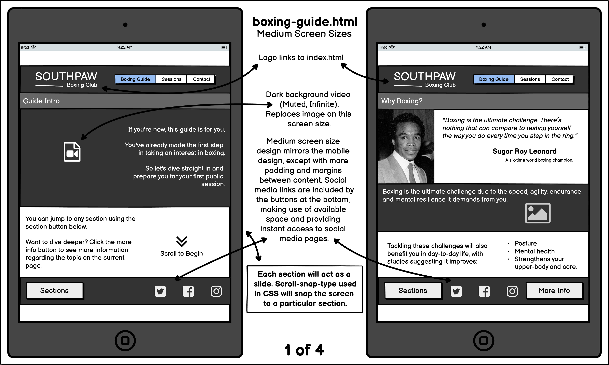
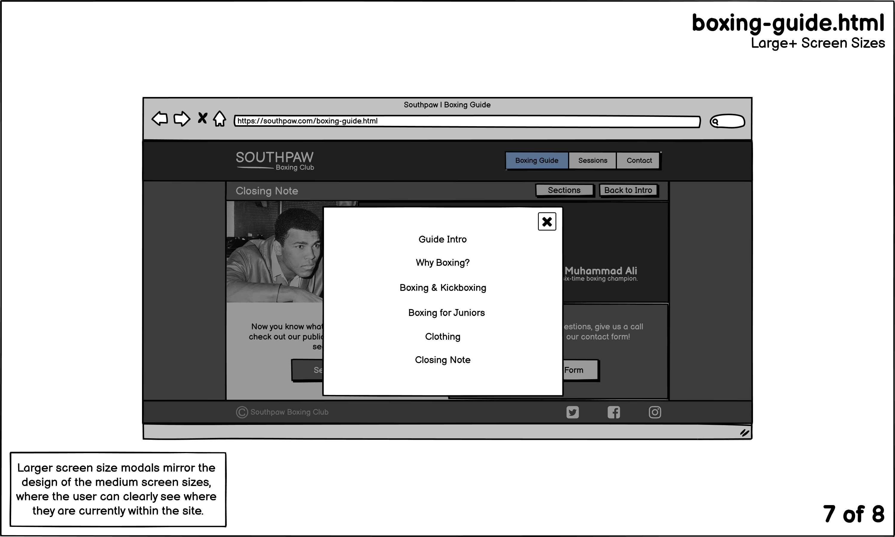

# Southpaw Boxing Club

## Summary

Short summary of website will go here.

[picture of site presented in multiple screen sizes]

## Index

1. [UX](#UX)

   - [Project Goals](#Project-Goals)
   - [User Stories](#User-Stories)
   - [The Five Planes](#The-Five-Planes)
     - [Strategy](#Strategy)
     - [Scope](#Scope)
     - [Structure](#Structure)
     - [Skeleton](#Skeleton)
     - [Surface](#Surface)

1. [Features](#Features)

   - [Current](#Current)
   - [Potential](#Potential)

1. [Testing](#testing)

   - [Validator Testing](#Validator-Testing)

1. [Deployment](#Deployment)

1. [Technologies](#Technologies)

1. [Credits](#Credits)

   - [Code](#Code)
   - [Resources](#Resources)
   - [Content](#Content)
   - [Media](#Media)

1. [Acknowledgements](#Acknowledgements)

## UX

### The Five Planes

I'll be utilising the the Five Plane of User Experience Design methodology by Jesse James Garrett during the development cycle of this project. This is to take the project from inception to final release, by dispersing the development of content and features over 5 interdependent planes to create a more fully realized product.

### Project Goals

The primary goal of the Southpaw Boxing Club website is to present information regarding the boxing club, for those interested in boxing themselves or for parents who are interested in their child(ren) attending boxing sessions.

### User Stories

  
As a new visitor and potential attendee, I want to:

- Discern whether the boxing club is suitable for my current level of boxing experience.
- Quickly observe the public sessions, deducing as to which sessions are most suitable for my current goals.
- Be informed as to what clothing is appropriate for the boxing sessions.

  
As a new visitor who is a parent of a potential attendee, I want to:

- Understand the organisation and it's sessions in detail, to dicern whether it's the right fit for my child.
- Be informed as to what clothing my child should wear when attending boxing sessions.

  
As a returning visitor, I want to:

- Contact the organisation for the purpose of discussing and scheduling a private session.
- Quickly observe the public sessions, to investigate the sessions I have not attended thus far.

  
As a visitor in general, I want to:

- Swiftly navigate to the parts of the website which are relevant to me.
- Promptly discover the times and locations for each public session respectively.
- Be able to contact the organisation for any additional questions I may have.
- Easily find the organisations' social media links, so I can keep up to date with what's new.

### Strategy

  
The Customer

- The primary demographic of the target audience, will be either male or female and be between the ages of 14 and 30 years old.
- The secondary demographic of the target audience, will be parents whose children are aged between 8 and 13 years old.

**Goals**

- The target audience wants to learn about the Southpaw Boxing Club, get a feel for what the club represents and what it can do for them regarding their own and/or child's personal boxing-related goals.
- They'll expect the website to be aesthetically pleasing, sporting a modern and sleek design in keeping with modern sport brand trends.
- The primary target audience will likely be uninterested with large portions of text, and will instead look for short and snappy snippets of information that are relevant to them and their visit.
- The secondary target audience will seek for more information regarding the boxing club, especially relating to how the boxing club trains children.

  
The Business

- A website presenting information on the Southpaw Boxing Club is necessary, given that the target audience is on the younger end of the spectrum and they will expect a website along with an online presence on social platforms.
- Tech considerations must be undertaken given the target audience's young age range, as they will likely be mobile savvy. Therefore a mobile-first approach is necessary, as small screen sizes will likely be the most common way this website is experienced.

**Goals**

- The primary goal of the website, is to convince those partially interested in attending to attend the club's boxing classes, creating a monetary return on investment from the payments made on the door.

- The secondary goal of the website is to push brand awareness, featuring it within all of the club's social media pages and ingraining effective SEO.

  
Competitor Reviews

[Noble Art Boxing](https://nobleartboxing.com/)

- <b>Pros</b>
  - Contact information is immediately present and stuck at the top of the page.
  - A Call to Action is immediately given on load, motivating the vistor to book a session today.
  - Presence of historical information regarding boxing styles on pages in which it's relevant.
  - Focusing on what boxing and the club in particular can do for the visitor, asking questions such as "What can White Collar Boxing do for you?" and "Why choose Kickboxing?".
- <b>Cons</b>
  - The text within the collapsed accordion nav bar shown on mobile & tablet screen sizes is hard to read, due to poor colour contrast.
  - Information on boxing styles is provided within an article-like format, which would do very little in emotionally triggering the visitor to attend sessions.
  - The bottom of the page on desktop screens is cluttered with navigation links, as the navigation bar is stuck to the top of the page and the same links are in the footer.
- <b>What's missing? What could be improved?</b>

  - The navigation bar is cluttered with options. To simplify this condense the links down to broad sub-categories that encourages the visitor to take action, such as:
    1. <i>Get Started</i>
       - Brief history on various styles, the benefits they provide and (open in new tab) links for additional information if the visitor is intrigued.
    1. <i>Get Involved</i> (hovering shows options underneath)
       - <i>Public Sessions</i>
         - Timetables
       - <i>Private Sessions</i>
         - Supply the visitor with options of contacting via phone call or email (using a form within the webpage).
       - <i>Upcoming Events</i>
    1. <i>Get in Touch</i>
       - Address of the boxing club.
       - Contact details such as phone and email.
       - A general form that allows the visitor to submit any questions they may have to the club.
  - The design and colour scheme isn't unique and therefore it would struggle to stand out amongst it's competition. A less common color palette and use of styling unique to this particular website would help seperate itself from it's competitors.
  - The webpages within this site are bloated with text content, which would leave the visitor un-inspired to read the content and likely switch off from the page altogether. To rectify this, filter the text down to what's relevant to the user and supply (open in new tab) links to external sites that delve into greater detail, giving the visitor the option to go into more detail.

[Pontypool Boxing Club](https://www.pontypoolboxing.co.uk/)

- <b>Pros</b>
  - A hero image immediately present celebrating competition success' relating to the boxing club, provides a sense of proven legitimacy to the club.
  - Use of broad navigation links keeps the user experience simple.
  - Information is consistently provided in a bullet point format, which keeps the text content concise and easily digestable for the visitor.
  - A consistent focus on the benefits the club and boxing in general can provide to the visitor.
- <b>Cons</b>
  - No presence of a phone number, removes the ability to call and receive the answers to their queries immediately.
  - The footer is styled poorly, with a font size that is too small and in conjuction with little letter spacing, this makes the text difficult to read.
  - Responsive design wasn't taken into account with unrefined styling covering most pages on smaller screen sizes, resulting in a poor user experience for those viewing the site on a mobile phone or tablet.
- <b>What's missing? What could be improved?</b>
  - The visitor won't expect social media links to be within the hero image, as it's not a website experience convention. Although the links could be easily found it still may confuse the visitor, therefore creating a negative user experience.
  - The nav bar should be stuck at the top, saving the visitor having to scroll to the top in order to navigate the website.

Potential Features

|                    Features                     | Importance |        Viability         |
| :---------------------------------------------: | :--------: | :----------------------: |
|         Pay for a booked session online         |     4      |            1             |
|   "What boxing style is for you?" guide page    |     5      |            4             |
|         Showcase attendee achievements          |     3      |            3             |
| Contact form (Private Sessions/General Queries) |     5      |            5             |
|            Online exercise sessions             |     3      |            2             |
|             Short on-demand lessons             |     2      |            1             |
|                                                 |  22 (Sum)  | 16.2 (Average Viability) |

Above are a list of potential features that are given a rating from 1 to 5 on importance and viability respectively.

- Pay for a booked session online
  - This would be an incredibly useful feature for the boxing club. It would provide opportunities such as:
    - The club receieving a payment before a visitor attends a session.
    - Not taking cash during the current pandemic, reducing the transmission of the virus.
  - However the technology to implement such a feature is not yet understood, therefore the viability of implementing the feature would be very minimal.
- "What boxing style is for you?" guide page
  - It's to be expected that most new visitors would have little to no experience with boxing, therefore it's unrealistic to expect this audience to know exactly what's right for them and their goals. Therefore this page is of upmost importance, as it can help guide the visitor to the style that's right for them.
  - As this page would operate as a "guide", it should be treated like a tour where the user is being guided by scrolling down the page.
  - A feature such as this would only need HTML, CSS and minimal JavaScript, meaning it will be very feasible.
- Showcase attendee achievements
  - This feature would provide further legitimacy to the club, highlighting how it has previously helped attendee's reach their goals.
  - It will act as a testimonial, which will further incentivise the visitor to attend the club's sessions.
  - Clicking on these achievements could take the user to an article page, which features articles written by those successful attendee's in support of the club.
  - This feature would only require HTML and CSS, making this feasible for the project.
- Online exercise sessions
  - This feature opens up the club up beyond a single venue, as users across the globe with a good internet connection can join into a video call with a boxing tutor.
  - Although this feature has tremendous potential, reach and monetary gain for both consumer and club respectively, the knowledge to implement such a feature is not yet known, making this unfeasible for the time being.
- Short on-demand lessons
  - Short bitsize lessons available online for the visitor to try, get's them immediately started and allows the visitor to determine whether the tutor's teaching style is suitable for them.
  - A feature such as this would require knowledge on video production in order to maintain a professional and modern look. This is not currently known, making this feature currently unfeasible.

### Scope

What's on the table?

For the initial release of the website, the features present should align with the strategy previously stated, helping both the visitor and business with their respective goals. Taking this into consideration along with the viability of some of the previously mentioned features, the features which should be on the table include:

- "What Boxing Style is for You? guide page
- A contact form that covers multiple facets of the business
- Showcase attendee achievements

Keeping the scope of this project to a minimal and realistic size, increases the likelihood of meeting provided deadlines. The features on the table could also be considered more a need than a want, as the visitor may need:

- Additional help in making an informed choice in what they wish to learn.
- A way to contact the club directly if they have any further questions.
- To see that the club is proven in helping individuals achieve their personal goals.

The features that are currently off the table, would be nice to include within the website but ultimately would not tackle visitor and business goals as much as those currently on the table. An argument could definitely be made that online payments would be a solid feature to implement, however the amount of time it would take to learn and implement this feature makes it unrealistic for the time being.

Therefore the features off the table for the time being are:

- Book & Pay Online
- Online Exercise Sessions
- Short on-demand Lessons

### Structure

An image of the webpage structure

.

### Skeleton

Wireframes for screen sizes can be viewed here:

Home Page (index.html)

Boxing Guide Page (boxing-guide.html)

Mobile screens

Tablet screens

Desktop screens

Sessions Page (sessions.html)

Contact Pages (contact.html & form-success.html)

### Surface

The design of the Southpaw Boxing Club website will feature a distinct visual language. This is essential in subtly providing information to the user, regarding the function and/or importance of elements presented in front of the them.

Here are the facets of the visual language and how the Southpaw Boxing Club website will take them into consideration.

- Colour - The colour palette will be as follows:
  
  The website will feature a partially monochrome look with a feature colour being "electric lime". The lime colour will provide minimal styling across the site and also provide navgational context, such as the active page on the nav bar and when the user hovers over a button/link.

- Layout - The layout will remain consistent throughout the site so it quickly becomes familiar to the user. This includes elements such as the navigation that's consistently placed at the top and the social media links remaining at the bottom right of every page. The only exception is the home page (index.html), this is so that the branding is front and center and the user can instantly navigate to the section they wish to visit.

- Typography

  - The font family used for the logo and header text is the [Big Shoulders Stencil Display](https://fonts.google.com/specimen/Big+Shoulders+Stencil+Display) font. This is a modern and distinct font style, making it suitable for the use of headers. The letter spacing will be wider within the site than the font default, making it easier to read and gives it a more modern look.
  - The font family used for general text throughout the site is the [Raleway](https://fonts.google.com/specimen/Raleway) font. This modern sans-serif font is suitable as it's easy to read, which will be useful for smaller screen sizes and also features multiple weight, italic and bold variations, allowing another way to inform the user that a particular piece of text may be of value to them.

- Images/Video - Images and video elements throughout the site will sport the monochrome look, further supporting the visual style of the site.

[Return to Index](#index)

## Features

### Current

### Future

[Return to Index](#index)

## Testing

### Validator Testing

- HTML
  - \* errors were returned when passing through the official [W3C Validator](https://validator.w3.org/)
- CSS
  - \* errors were found when passing through the official [Jigsaw Validator](https://jigsaw.w3.org/css-validator/)

[Return to Index](#index)

## Deployment

[Return to Index](#index)

## Technologies

  
Languages

- HTML5
- CSS3

  
Libraries & Frameworks

- [Bootstrap 5](https://getbootstrap.com/)
- [Google Fonts](https://fonts.google.com/)
- [Font Awesome](https://fontawesome.com/)

  
Applications

- [VS Code](https://code.visualstudio.com/) was utilised to develop the project.
  - The [Live Server](https://marketplace.visualstudio.com/items?itemName=ritwickdey.LiveServer) extension was used to have a live, realtime preview of the webpage.
  - The [Prettier](https://marketplace.visualstudio.com/items?itemName=esbenp.prettier-vscode) extension was utilised to format my code in a consistent manner.
  - The [Markdown Preview Enhanced](https://marketplace.visualstudio.com/items?itemName=shd101wyy.markdown-preview-enhanced) extension was utilised to have a live, realtime preview of this README.md file.
- [Balsamiq](https://balsamiq.com/) was used to create the wireframes during the Skeleton Plane phase.
- The [Coolors](https://coolors.co/) generator was utilised to come up with an appropriate color palette.
- [Affinity Designer](https://affinity.serif.com/en-gb/designer/) was used to create the Southpaw Boxing Club logo and compress images.
- [WebAim](https://webaim.org/resources/contrastchecker/) was utilised to check that the colour ratio between the text and background colours met the accessibilty standards
- [Tables Generator](https://www.tablesgenerator.com/markdown_tables) was utilised to quickly format a table for this README.
- [Converterpoint](https://converterpoint.com/) was used to optimize videos ready for the web.
  

[Return to Index](#index)

## Credits

### Code

1. I used the code example provided by [Yakov](https://stackoverflow.com/users/4349420/yakov) within [this Stack Overflow post](https://stackoverflow.com/questions/27419509/make-a-href-which-open-a-google-map-with-specific-address), to create links that send the user to google maps focusing on each gym venue respectively. This can be found within the [sessions.html](sessions.html) file.

2. I used a code example provided by [David](https://stackoverflow.com/users/7753808/david) within [this Stack Overflow post](https://stackoverflow.com/questions/36949747/make-video-fit-100-with-any-screen-resolution), to centre a video within it's container. This can be found within the [style.css](assets/css/style.css) file.

3. I used a code example provided by [G-Cyrillus](https://stackoverflow.com/users/2442099/g-cyrillus) and [Mosh Feu](https://stackoverflow.com/users/863110/mosh-feu) within [this Stack Overflow post](https://stackoverflow.com/questions/36679649/how-to-add-a-color-overlay-to-a-background-image), to set a dark overlay over the background image of the #guide-intro-welcome section, within the [boxing-guide.html](boxing-guide.html) file.

### Resources

- I encountered a problem where hovering wasn't functioning properly on elements within the navigation bar. I found out that I wasn't writing the syntax correctly by looking at [this Stack Overflow post](https://stackoverflow.com/questions/5777210/how-to-write-hover-condition-for-abefore-and-aafter).

- I stumbled across an issue where the navigation bar was not sticking to the top of the viewport after using "position: sticky". After looking at [this Stack Overflow post](https://stackoverflow.com/questions/43707076/how-does-the-position-sticky-property-work), I noticed I had not included a "threshold with at least one of top, right, bottom or left". After including "top: 0", the problem was resolved.

- I struggled to select the last p element of the guide-intro-welcome section within boxing-guide.html. My intention was to remove the margin-bottom. After looking at [this CSS-Tricks article](https://css-tricks.com/almanac/selectors/l/last-child/), I encountered the useful :last-child pseudo-class which solved this problem.

- Video playback wasn't working as expected on mobile devices, where a still snapshot of the video was present instead of the video. This was easily fixed by including the playsinline attribute within the video tag, which I found out after looking at [Tom](https://stackoverflow.com/users/7540403/tom)'s reply to [this Stack Overflow post](https://stackoverflow.com/questions/38893692/html-video-not-working-on-mobile).

### Content

### Media

**Videos**

- Credit to [cottonbro](https://www.pexels.com/@cottonbro) for the videos listed below:

  - [This video](https://www.pexels.com/video/two-men-doing-cardio-exercises-4761431/) was used within the private sessions section of the [sessions.html](sessions.html) file.

  - [This video](https://www.pexels.com/video/sport-child-strength-exercise-4752902/) was used within the junior boxing section of the [boxing-guide.html](boxing-guide.html) file.

**Images**

- Credit to [cottonbro](https://www.pexels.com/@cottonbro) for the images listed below:

  - [This image](https://www.pexels.com/photo/man-in-black-boxing-gloves-4752871/) was used within the intro section of the [boxing-guide.html](boxing-guide.html) file.

  - [This image](https://www.pexels.com/photo/topless-man-with-blue-boxing-gloves-4754131/) was used as a background image for the [boxing-guide.html](boxing-guide.html) file.

  - [This image](https://www.pexels.com/photo/man-in-black-shirt-and-pants-sitting-on-exercise-equipment-4761785/) was used within the boxing & kickboxing section of the [boxing-guide.html](boxing-guide.html) file.

  - [This image](https://www.pexels.com/photo/woman-in-black-sports-bra-and-black-leggings-doing-exercise-4754119/) was used within the boxing & kickboxing section of the [boxing-guide.html](boxing-guide.html) file.

  - [This image](https://www.pexels.com/photo/man-in-black-t-shirt-holding-white-ceramic-mug-4754143/) was used within the boxing & kickboxing section of the [boxing-guide.html](boxing-guide.html) file.

  - [This image](https://www.pexels.com/photo/woman-in-gray-tank-top-and-black-leggings-4754002/) was used within the clothing section of the [boxing-guide.html](boxing-guide.html) file.

  - [This image](https://www.pexels.com/photo/man-in-black-tank-top-leaning-on-black-pole-4753984/) was used within the clothing section of the [boxing-guide.html](boxing-guide.html) file.

  - [This image](https://www.pexels.com/photo/woman-in-white-tank-top-and-black-shorts-standing-beside-wall-4753892/) was used within the clothing section of the [boxing-guide.html](boxing-guide.html) file.

  - [This image](https://www.pexels.com/photo/man-in-white-tank-top-and-black-pants-sitting-on-white-bench-4761611/) was used within the clothing section of the [boxing-guide.html](boxing-guide.html) file.

  - [This image](https://www.pexels.com/photo/woman-in-gray-shirt-and-blue-denim-jeans-sitting-on-black-and-yellow-stairs-4752835/) was used in the public sessions section of the [sessions.html](sessions.html) file.

  - [This image](https://www.pexels.com/photo/woman-in-black-dress-sitting-on-brown-wooden-bench-4753886/) was used in the public sessions section of the [sessions.html](sessions.html) file.

  - [This image](https://www.pexels.com/photo/man-in-white-crew-neck-t-shirt-and-black-shorts-4761383/) was used within the [contact.html](contact.html) file.

- Credit to [Wikimedia Commons](https://commons.wikimedia.org/wiki/Main_Page) for the images listed below:

  - [This image](<https://commons.wikimedia.org/wiki/File:Sugar_Ray_Leonard,_1984_(cropped).jpg>) was used within the Why Boxing? section of the [boxing-guide.html](boxing-guide.html) file. Originally sourced by the [City of Boston Archives](https://www.flickr.com/people/48039697@N05).

  - [This image](https://commons.wikimedia.org/wiki/File:Muhammad_Ali_1966.jpg) was used within the Closing Note section of the [boxing-guide.html](boxing-guide.html) file. Originally sourced by the [Dutch National Archives](https://www.nationaalarchief.nl/en/research).

[Return to Index](#index)

## Acknowledgements

[Return to Index](#index)
